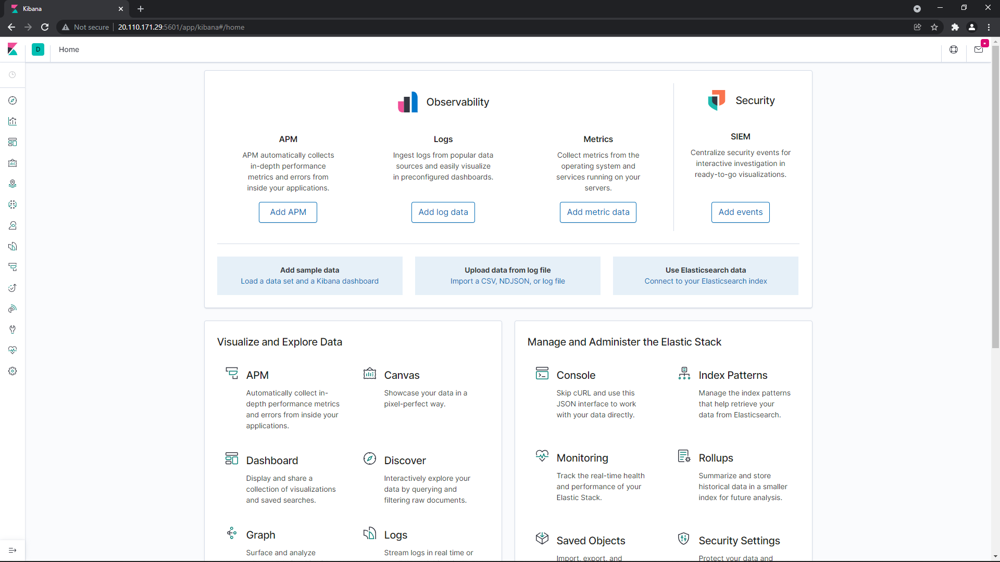
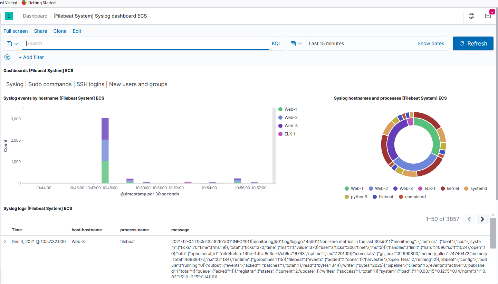

# Automated ELK Stack Deployment

The files in this repository were used to configure the network depicted below.

The config and playbook files have been tested and used to generate a live ELK deployment on Azure. They can be used to create create and spin up all the required VMs in the network diagram and can easibly be modified to add more machines to the network. All scripts run with a tool called [Ansible](https://www.ansible.com/) to configure the machines to have the same settings.

- install_webserver.yml
  - This will create another instance of the webserver from a docker image
- install_elk.yml
  - This will create the a machine with the ELK stack monitoring capabilities
- filebeat-playbook.yml
  - This will create and start up filebeat to gather log information for analysis
- metricbeat-playbook.yml
  - This will create and start up metricbeat to analyze gathered information regarding the machines in the network.

### Description of the Topology

The purpose of this network is to give a secruity team the ability to test web vulnerablilities of an instance of the DVWA web servers

### Load Balancer

The Load Balancer implemented in this network is to ensure that the web site ultimately has high availability even in the event of a ddos attack that attempts to bring the site down.

### Network Restrictions

Security groups were added to the network to ensure that the network is only accessible from within the network with some exceptions for the Jumpbox that will be used to connect to the internal VM's and the ELK VM for monitoring and analytics.

- A reason that we are using a Jumpbox to manage access to the other virtual machines is so that we can limit our exposure to outside attacks and additionally the Jumpbox will allow us to generate new machines very quickly due to the Ansible deployment method.

### Filebeat and Metricbeat

- [Filebeat](https://www.elastic.co/beats/filebeat): A lightweight shipper for forwarding and centralizing log data

- [Metricbeat](https://www.elastic.co/beats/metricbeat): A lightweight shipper that collects metrics from machines within a network to monitor activity within it.

### Network Configurations

The configuration details of each machine may be found below.

| Name                 | Function  | IP Address                | Operating System |
| -------------------- | --------- | ------------------------- | ---------------- |
| Jump-Box-Provisioner | Gateway   | 20.124.252.132 / 10.0.0.4 | Linux            |
| Web-1                | Webserver | 10.0.0.5                  | Linux            |
| Web-2                | Webserver | 10.0.0.6                  | Linux            |
| Web-3                | Webserver | 10.0.0.7                  | Linux            |
| ELK-1                | Analysis  | 20.119.183.62 / 10.2.0.4  | Linux            |

### Access Policies

The machines on the internal network are not exposed to the public Internet.

Only the **Jumpbox Provisioner** and **ELK-1** machine can accept connections from the Internet. Access to this machine is only allowed from the following IP addresses: **75.188.69.41**

Machines within the network can only be accessed by **Jumpbox Provisioner**.

A summary of the access policies in place can be found in the table below.

| Name                 | Publicly Accessible | Allowed IP Addresses |
| -------------------- | ------------------- | -------------------- |
| Jump-Box-Provisioner | Yes                 | 75.188.69.41         |
| Web-1                | No                  | 10.0.0.4             |
| Web-2                | No                  | 10.0.0.4             |
| Web-3                | No                  | 10.0.0.4             |
| ELK-1                | Yes                 | 75.188.69.41         |

### Elk Configuration

Ansible was used to automate configuration of the ELK machine. No configuration was performed manually, which is advantageous because in the event of needing to deploy machines quickly, we can just add them to the configuration file and run with the VM is available. This is also benefictial cause we can ensure all the

The playbook implements the following tasks:

<ol>
  <li>Download filebeat/metricbeat</li>
  <li>Install filebeat/metricbeat on target machine</li>
  <li>Copy configuration file from jumpbox onto the target machine</li>
  <li>Enable modules within system</li>
  <li>Setup filebeat/metricbeat</li>
  <li>Setup filebeat/metricbeat</li>
  <li>Enable filebeat/metricbeat on boot</li>
</ol>

The following screenshot displays the result of running `docker ps` after successfully configuring the ELK instance.

### Target Machines & Beats

This ELK server is configured to monitor the following machines:

- 10.0.0.5
- 10.0.0.6
- 10.0.0.7

We have installed the following Beats on these machines:

- Web-1
- Web-2
- Web-3

These Beats allow us to collect the following information from each machine:

- Filebeat: For collecting and shipping log files
- Packetbeat: A network packet analyzer
- Metricbeat: Collects and reports various system-level metrics
- Heartbeat: Meant for "uptime monitoring"
- Auditbeat: Auditing user and process activity on Linux servers
- Winlogbeat: Collecting Windows Event logs
- Functionbeat: A "serverless" shipper that is deployed as a function
- Journalbeat: Systemd log jorunals
- Community beats: beats developed by the community

Some more information can be found at this tutorial link [Logz.io](https://logz.io/blog/beats-tutorial/)

### Using the Playbooks

In order to use the playbook, you will need to have an Ansible control node already configured on the Jumpbox Provisioner.

SSH into the Jumpbox Provisioner once the new VM has been established and follow the steps below:

- Update the **hosts** file on the Jumpbox Provisioner machine to include the new internal IP address of the VM under the webserver category

  `nano <playbook>.yml`

- The playbook will copy the Jumpbox's **filebeat-config.yml or metricbeat-config.yml** file to **/etc/filebeat/filebeat.yml or /etc/metricbeat/metricbeat.yml**. Allowing it to get correctly configured to the new machine
- Run the playbook, and SSH into the new machine

  `ssh <username>@<target Ip>`

- Confirm that the new machine is running the docker container with all the right configurations

  `sudo docker ps`

### Confirmation of Success

If all the playbooks and configurations have been completed successfully you should see the the **Kibana** application hosted at your internal IP of the host machine. Type this address into Chrome/Firefox/Edge: `http://<internal ip>:5601/app/kibana`

Additionally if you have correctly set up **Filebeat** on the webserver, you will be able to see that data within Kibana and will be able to monitor traffic for the servers.

Finally if you have installed **Metricbeat** successfully on the webservers, you will be able to view that data within Kibana as well.

